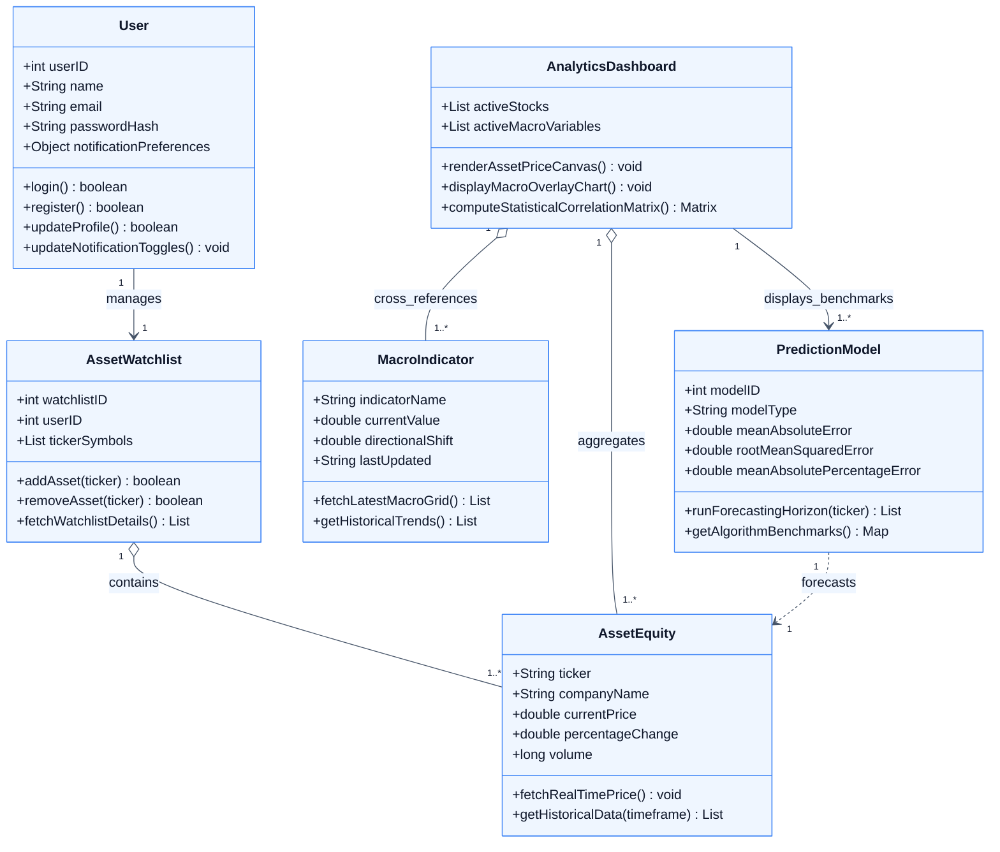

# 📐 MacroPulse Institutional Terminal — UML Class Diagram

This document contains the **UML Class Diagram** representing the static structural design of the **MacroPulse Institutional Terminal**, detailing the core domain entities, operational methods, attributes, and relationships.

---

## 📌 1. UML Class Diagram (Mermaid.js)

---

## 📋 2. Class Responsibilities & Multiplicity Reference

| Class Name | Primary Responsibility | Key Associations |
| :--- | :--- | :--- |
| **`User`** | Manages analyst authentication, session states, and alert preferences. | Holds a $1 : 1$ directional association to `AssetWatchlist` via `manages`. |
| **`AssetWatchlist`** | Maintains personal bookmarked equities for portfolio surveillance. | Aggregates `AssetEquity` ($1 : 1..*$) via `contains`. |
| **`AssetEquity`** | Models stock market assets with live quotes, OHLCV bars, and volume. | Contained in `AssetWatchlist`, aggregated by `AnalyticsDashboard`, target of `PredictionModel` forecasts. |
| **`MacroIndicator`** | Captures sovereign economic time series (OPR, CPI, GDP, FRED series). | Aggregated by `AnalyticsDashboard` ($1 : 1..*$) via `cross_references`. |
| **`AnalyticsDashboard`** | Central UI coordinator that renders Canvas candlesticks and correlation matrices. | Aggregates `MacroIndicator`, `AssetEquity`, and associates to `PredictionModel`. |
| **`PredictionModel`** | Executes ML inference (BiLSTM, XGBoost, Prophet) and logs error metrics ($MAE$, $RMSE$, $MAPE$). | Depends on `AssetEquity` ($1 : 1$) via `forecasts`. |
