# 📊 MacroPulse Relational Database — Entity-Relationship (ER) Diagram

This document contains the complete Entity-Relationship (ER) specification for the **MacroPulse Institutional Terminal** (`macropulse_db`), covering all 11 relational tables, keys, cardinalities, and data dictionary.

---

## 📌 ER Diagram (Mermaid)

```mermaid
erDiagram
    USERS ||--o{ USER_SESSIONS : "initiates"
    USERS ||--o{ PASSWORD_RESETS : "requests"
    USERS ||--|| USER_WORKSPACE_SETTINGS : "customizes"
    USERS ||--|| USER_NOTIFICATION_RULES : "defines"
    USERS ||--o{ USER_WATCHLISTS : "bookmarks"
    STOCKS ||--o{ USER_WATCHLISTS : "cataloged_in"
    STOCKS ||--o{ MODEL_RUN_LOGS : "benchmarked_on"
    MODEL_METADATA ||--o{ MODEL_RUN_LOGS : "executes"
    MACRO_INDICATORS ||--o{ MACRO_OBSERVATIONS : "records"

    USERS {
        int id PK "auto_increment"
        varchar email UK "unique login"
        varchar password_hash "PBKDF2/SHA-256"
        varchar full_name "Analyst full name"
        varchar role_title "Designation"
        varchar department "Divisional affiliation"
        varchar timezone "e.g. UTC+8"
        text bio "Profile biography"
        mediumtext avatar_url "Base64 / Image URI"
        varchar api_key UK "Unique Terminal API Key"
        tinyint two_factor_enabled "2FA flag"
        tinyint terms_accepted "Compliance flag"
        tinyint is_active "Account state"
        timestamp last_login_at "Audit login"
        timestamp created_at "Registration stamp"
        timestamp updated_at "Update stamp"
    }

    USER_SESSIONS {
        varchar session_id PK "mp_live_... / UUID"
        int user_id FK "References USERS(id)"
        varchar ip_address "Client IP"
        varchar user_agent "Browser / OS header"
        varchar location "Geo-location string"
        tinyint is_active "Active token state"
        timestamp created_at "Session issue time"
        timestamp last_active_at "Heartbeat stamp"
    }

    PASSWORD_RESETS {
        bigint id PK "auto_increment"
        int user_id FK "References USERS(id)"
        varchar email "User recovery email"
        varchar reset_code "6-digit OTP code"
        varchar token_hash "Cryptographic reset token"
        timestamp expires_at "15-minute expiration"
        tinyint is_used "One-time flag"
        timestamp created_at "Issue timestamp"
    }

    LOGIN_ATTEMPTS {
        bigint id PK "auto_increment"
        varchar email "Attempted user email"
        varchar ip_address "Remote IP address"
        tinyint is_successful "1=Success, 0=Failed"
        timestamp attempted_at "Audit timestamp"
    }

    USER_WORKSPACE_SETTINGS {
        int id PK "auto_increment"
        int user_id FK "References USERS(id), UNIQUE"
        varchar default_landing_view "overview, trading, etc."
        varchar benchmark_index "e.g. ^KLSE, ^GSPC"
        varchar lookback_horizon "1mo, 3mo, 1y, 5y"
        varchar focus_sector "all, Financials, Tech"
        varchar reporting_currency "MYR, USD, EUR, SGD"
        int polling_rate_seconds "Refresh cadence (15s)"
        tinyint audio_chimes_enabled "Web Audio sound flag"
        timestamp updated_at "Settings update stamp"
    }

    USER_NOTIFICATION_RULES {
        int id PK "auto_increment"
        int user_id FK "References USERS(id), UNIQUE"
        tinyint notify_opr "OPR policy shift alerts"
        tinyint notify_cpi "Headline CPI alerts"
        tinyint notify_stocks "Watchlist volatility alerts"
        tinyint notify_inflow "Foreign capital flow alerts"
        timestamp updated_at "Rule update stamp"
    }

    STOCKS {
        varchar symbol PK "e.g. 1155.KL, NVDA"
        varchar name "Full company legal name"
        varchar exchange "KLSE, NASDAQ, NYSE"
        varchar country "MY, US, TW"
        varchar sector "Financials, Tech, Energy"
        tinyint is_active "Trading status"
        timestamp created_at "Catalog entry stamp"
    }

    USER_WATCHLISTS {
        int id PK "auto_increment"
        int user_id FK "References USERS(id)"
        varchar stock_symbol FK "References STOCKS(symbol)"
        decimal target_buy_price "Target entry limit"
        decimal target_sell_price "Target exit limit"
        varchar notes "Analyst investment thesis"
        timestamp added_at "Creation timestamp"
    }

    MACRO_INDICATORS {
        varchar indicator_id PK "e.g. BNM_OPR, FEDFUNDS"
        varchar name "Economic indicator name"
        varchar unit "%, Index, Billions USD"
        varchar frequency "Daily, Monthly, Quarterly"
        varchar category "Monetary, Inflation, Yield"
        varchar target_benchmark "Policy band / target"
        timestamp created_at "Registry stamp"
    }

    MACRO_OBSERVATIONS {
        bigint id PK "auto_increment"
        varchar indicator_id FK "References MACRO_INDICATORS(id)"
        date observation_date "Period cutoff date"
        decimal observation_value "Recorded quantitative metric"
        timestamp created_at "Ingestion stamp"
    }

    MODEL_METADATA {
        varchar model_id PK "lstm, transformer, etc."
        varchar model_name "Algorithm display title"
        varchar description "Architecture summary"
        varchar algorithm "BiLSTM, PatchTST, XGBoost"
        varchar framework "PyTorch, Scikit-Learn"
        timestamp created_at "Registration stamp"
    }

    MODEL_RUN_LOGS {
        bigint id PK "auto_increment"
        varchar model_id FK "References MODEL_METADATA(id)"
        varchar target_symbol FK "References STOCKS(symbol)"
        enum run_type "inference, retrain, backtest"
        decimal rmse "Root Mean Squared Error"
        decimal mae "Mean Absolute Error"
        decimal mape "Mean Absolute % Error"
        decimal accuracy_score "Overall fit accuracy %"
        decimal direction_accuracy "Hit Rate % (Up/Down)"
        decimal runtime_seconds "Inference latency (s)"
        varchar notes "Execution details"
        timestamp created_at "Execution timestamp"
    }
```

---

## 🔗 Cardinality & Relationship Matrix

| Parent Table | Child Table | Foreign Key Column | Cardinality | Cascade Action | Description |
| :--- | :--- | :--- | :---: | :--- | :--- |
| `users` | `user_sessions` | `user_id` | `1 : 0..*` | `ON DELETE CASCADE` | Multiple active device sessions per user. |
| `users` | `password_resets` | `user_id` | `1 : 0..*` | `ON DELETE CASCADE` | Audit log of OTP password reset requests. |
| `users` | `user_workspace_settings` | `user_id` | `1 : 1` | `ON DELETE CASCADE` | User terminal preferences & base currency. |
| `users` | `user_notification_rules` | `user_id` | `1 : 1` | `ON DELETE CASCADE` | Notification alert preferences. |
| `users` | `user_watchlists` | `user_id` | `1 : 0..*` | `ON DELETE CASCADE` | Analyst bookmarked equities. |
| `stocks` | `user_watchlists` | `stock_symbol` | `1 : 0..*` | `ON DELETE CASCADE` | Associative join between users and stock catalog. |
| `stocks` | `model_run_logs` | `target_symbol` | `1 : 0..*` | `ON DELETE CASCADE` | Target equity evaluated by AI models. |
| `model_metadata` | `model_run_logs` | `model_id` | `1 : 0..*` | `ON DELETE CASCADE` | Time-stamped inference & backtest run telemetry. |
| `macro_indicators`| `macro_observations` | `indicator_id` | `1 : 0..*` | `ON DELETE CASCADE` | Historical time-series points per macro series. |
