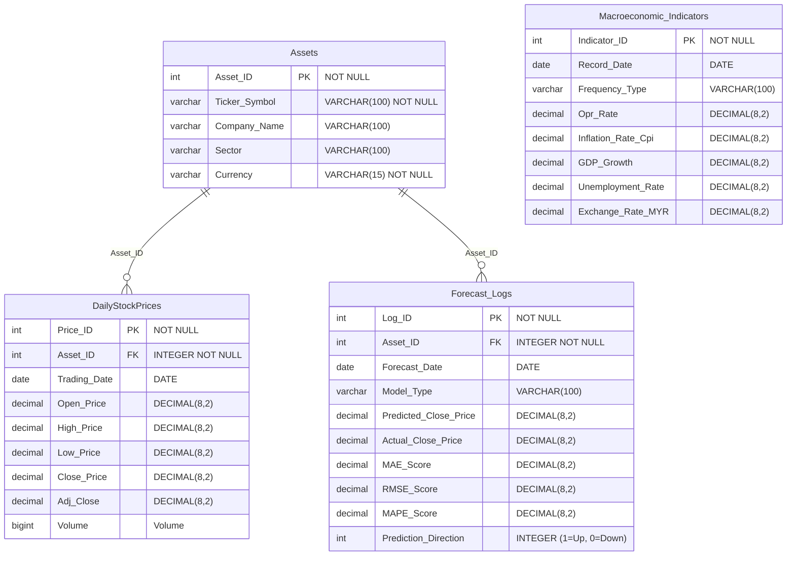
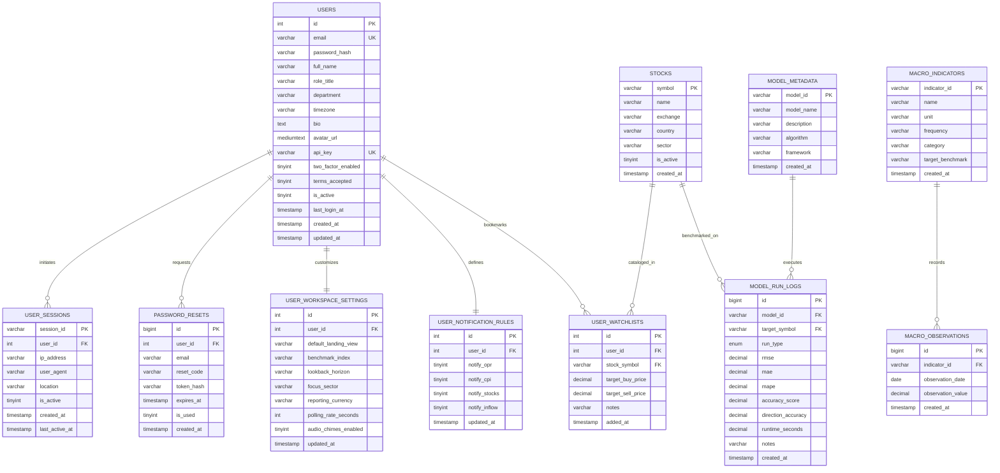

# 📊 MacroPulse Relational Database — Entity-Relationship (ER) Diagram

This document contains the complete Entity-Relationship (ER) specifications for the **MacroPulse Terminal**, featuring both the **Core Analytics Schema** (Assets, DailyStockPrices, Forecast_Logs, Macroeconomic_Indicators) and the **Full Institutional Schema**.

---

## 📌 1. Core Analytics ER Diagram (Matching System Design)



---

## 🛠️ 2. DBML Code (for https://dbdiagram.io)

Copy and paste this snippet directly into [dbdiagram.io](https://dbdiagram.io) to generate the exact dark-grid visual diagram with crow's foot connectors:

```dbml
Table Assets {
  Asset_ID int [pk, not null]
  Ticker_Symbol varchar(100) [not null]
  Company_Name varchar(100)
  Sector varchar(100)
  Currency varchar(15) [not null]
}

Table DailyStockPrices {
  Price_ID int [pk, not null]
  Asset_ID integer [not null]
  Trading_Date date
  Open_Price decimal(8,2)
  High_Price decimal(8,2)
  Low_Price decimal(8,2)
  Close_Price decimal(8,2)
  Adj_Close decimal(8,2)
  Volume bigint
}

Table Forecast_Logs {
  Log_ID int [pk, not null]
  Asset_ID integer [not null]
  Forecast_Date date
  Model_Type varchar(100)
  Predicted_Close_Price decimal(8,2)
  Actual_Close_Price decimal(8,2)
  MAE_Score decimal(8,2)
  RMSE_Score decimal(8,2)
  MAPE_Score decimal(8,2)
  Prediction_Direction integer
}

Table Macroeconomic_Indicators {
  Indicator_ID int [pk, not null]
  Record_Date date
  Frequency_Type varchar(100)
  Opr_Rate decimal(8,2)
  Inflation_Rate_Cpi decimal(8,2)
  GDP_Growth decimal(8,2)
  Unemployment_Rate decimal(8,2)
  Exchange_Rate_MYR decimal(8,2)
}

Ref: Assets.Asset_ID < DailyStockPrices.Asset_ID
Ref: Assets.Asset_ID < Forecast_Logs.Asset_ID
```

---

## 🗄️ 3. SQL DDL Table Creation Script

```sql
CREATE TABLE `Assets` (
  `Asset_ID` INT AUTO_INCREMENT PRIMARY KEY,
  `Ticker_Symbol` VARCHAR(100) NOT NULL UNIQUE,
  `Company_Name` VARCHAR(100) NULL,
  `Sector` VARCHAR(100) NULL,
  `Currency` VARCHAR(15) NOT NULL DEFAULT 'MYR'
) ENGINE=InnoDB DEFAULT CHARSET=utf8mb4;

CREATE TABLE `DailyStockPrices` (
  `Price_ID` INT AUTO_INCREMENT PRIMARY KEY,
  `Asset_ID` INT NOT NULL,
  `Trading_Date` DATE NOT NULL,
  `Open_Price` DECIMAL(8,2) NULL,
  `High_Price` DECIMAL(8,2) NULL,
  `Low_Price` DECIMAL(8,2) NULL,
  `Close_Price` DECIMAL(8,2) NULL,
  `Adj_Close` DECIMAL(8,2) NULL,
  `Volume` BIGINT NULL,
  CONSTRAINT `fk_prices_asset` FOREIGN KEY (`Asset_ID`) 
    REFERENCES `Assets` (`Asset_ID`) ON DELETE CASCADE
) ENGINE=InnoDB DEFAULT CHARSET=utf8mb4;

CREATE TABLE `Forecast_Logs` (
  `Log_ID` INT AUTO_INCREMENT PRIMARY KEY,
  `Asset_ID` INT NOT NULL,
  `Forecast_Date` DATE NOT NULL,
  `Model_Type` VARCHAR(100) NOT NULL,
  `Predicted_Close_Price` DECIMAL(8,2) NOT NULL,
  `Actual_Close_Price` DECIMAL(8,2) NULL,
  `MAE_Score` DECIMAL(8,2) NULL,
  `RMSE_Score` DECIMAL(8,2) NULL,
  `MAPE_Score` DECIMAL(8,2) NULL,
  `Prediction_Direction` INT NULL,
  CONSTRAINT `fk_forecast_asset` FOREIGN KEY (`Asset_ID`) 
    REFERENCES `Assets` (`Asset_ID`) ON DELETE CASCADE
) ENGINE=InnoDB DEFAULT CHARSET=utf8mb4;

CREATE TABLE `Macroeconomic_Indicators` (
  `Indicator_ID` INT AUTO_INCREMENT PRIMARY KEY,
  `Record_Date` DATE NOT NULL,
  `Frequency_Type` VARCHAR(100) NOT NULL,
  `Opr_Rate` DECIMAL(8,2) NULL,
  `Inflation_Rate_Cpi` DECIMAL(8,2) NULL,
  `GDP_Growth` DECIMAL(8,2) NULL,
  `Unemployment_Rate` DECIMAL(8,2) NULL,
  `Exchange_Rate_MYR` DECIMAL(8,2) NULL
) ENGINE=InnoDB DEFAULT CHARSET=utf8mb4;
```

---

## 🏛️ 4. Full Institutional Schema (Auth & User Governance)


