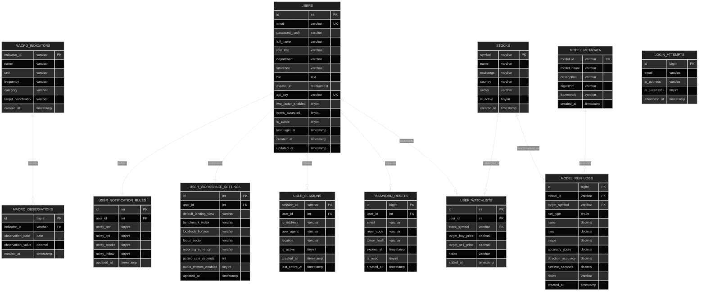

# 📊 MacroPulse Relational Database — Entity-Relationship (ER) Diagram

This document contains the complete Entity-Relationship (ER) specification for the **MacroPulse Institutional Terminal** (`macropulse_db`), with **Key / Column Names on the LEFT** and **Data Types on the RIGHT** matching relational database design standards.

---

## 📌 Institutional ER Diagram (Mermaid.js)

