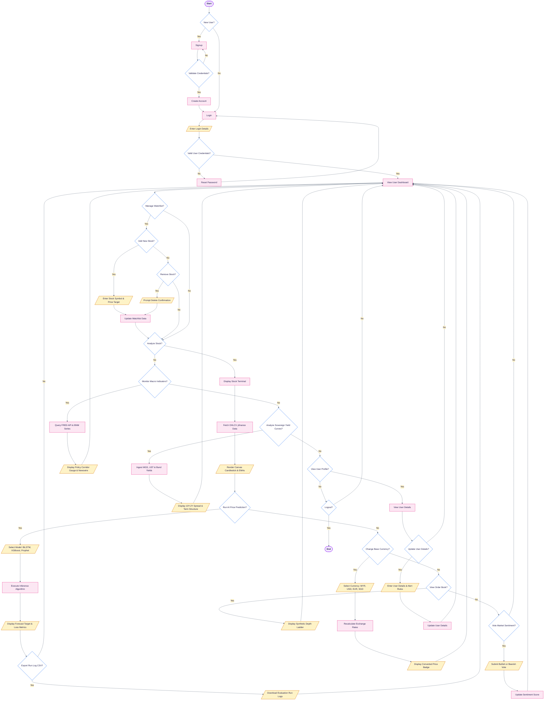

# 🔄 MacroPulse Institutional Terminal — Academic System Flowchart

A software engineering system flowchart adhering strictly to standard Mermaid.js syntax without parser errors, formatted with the exact visual language of your reference diagram:
* **Vertical Alignment**: **`Start`** at the top of the main vertical spine and **`End`** directly at the bottom of the exact same spine.
* **Terminators (`Start` / `End`)**: Rounded pill shapes (`([Start])`, `([End])`) with purple outlines.
* **Decisions**: Diamond shapes (`{Decision?}`) with clean blue outlines and `Yes` / `No` branches.
* **Input / Output Operations**: Slanted amber parallelograms (`[/Input or Display Data/]`).
* **Internal Processes**: Soft pink rectangles (`[Process Step]`).

---

## 📌 1. Vertically Aligned Mermaid.js Flowchart (Start $\leftrightarrow$ End)

