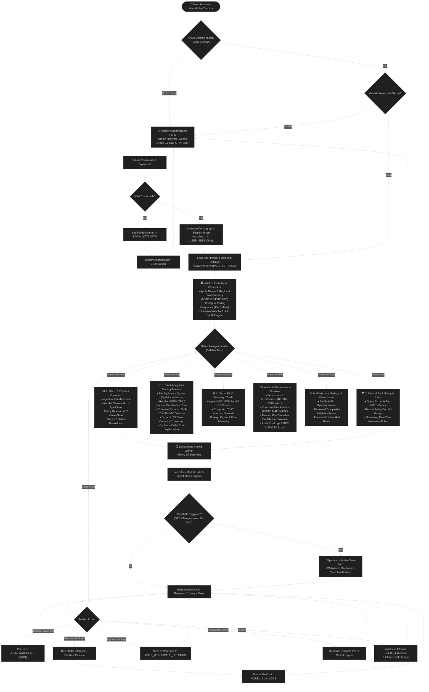

# 🔄 MacroPulse Institutional Terminal — System Flowchart

This document details the complete end-to-end **System Flowchart** for the **MacroPulse Institutional Terminal**, detailing the user journey from authentication and security token verification to multi-dashboard routing, real-time data ingestion, quantitative AI model benchmarking, and background event-driven telemetry.

---

## 📌 1. Complete System Flowchart (Mermaid.js)

---

## 🔍 2. Detailed Breakdown by Architectural Phase

### Phase 1: Identity Verification & Session Initialization
1. **Entry Point**: The analyst connects to the client application (`index.html`).
2. **Token Verification**: The browser inspects `localStorage` for a cryptographic session token (`mp_live_...`).
3. **Authentication Modal**: If no active session exists, the portal offers:
   - **Password-based login** (hashed with PBKDF2/SHA-256 against `users`).
   - **Google OAuth 2.0 (GIS)** identity verification.
   - **SMTP 2-Step OTP Password Reset** (transmitting a 15-minute 6-digit recovery code).
4. **Audit Enforcement**: Successful logins issue an entry in `user_sessions`. Failed attempts trigger an increment in `login_attempts` to defend against brute-force attacks.

### Phase 2: Workspace Customization & Routing
1. **Preference Hydration**: The terminal loads settings from `user_workspace_settings`:
   - Selected Base Currency (`MYR`, `USD`, `EUR`, `SGD`).
   - Polling Frequency (defaults to 15s).
   - Audio Chimes (Web Audio API synth).
2. **Dashboard Dispatcher**: The analyst is routed to their preferred landing view or selects any of the 6 specialized dashboards via sidebar navigation.

### Phase 3: Real-Time Data Ingestion & Analytics
- **Bursa Malaysia & US Equities Engine**: Fetches live tick and OHLCV bars using the Python `yfinance` microservice wrapper.
- **FRED Intelligence Engine**: Directly queries St. Louis Fed endpoints (`FEDFUNDS`, `CPIAUCSL`, `GDPC1`, `UNRATE`) with TTL caching.
- **Canvas Rendering Engine**: Executes double-buffered pixel rendering loops for candlestick wicks, bodies, moving averages, and crosshairs at 60 FPS without DOM overhead.

### Phase 4: Quantitative AI Forecasting & Benchmarking
- Users select an asset and AI architecture (Stacked BiLSTM, XGBoost, Prophet, SARIMAX, PatchTST).
- The system evaluates forecast horizons (5D, 15D, 30D), computes statistical loss metrics ($RMSE$, $MAE$, $MAPE$, directional accuracy), and stores the telemetry trace in `model_run_logs`.
