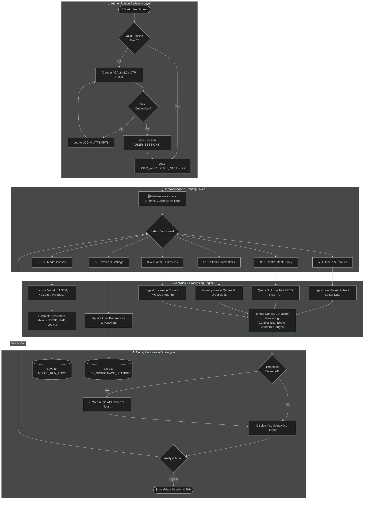
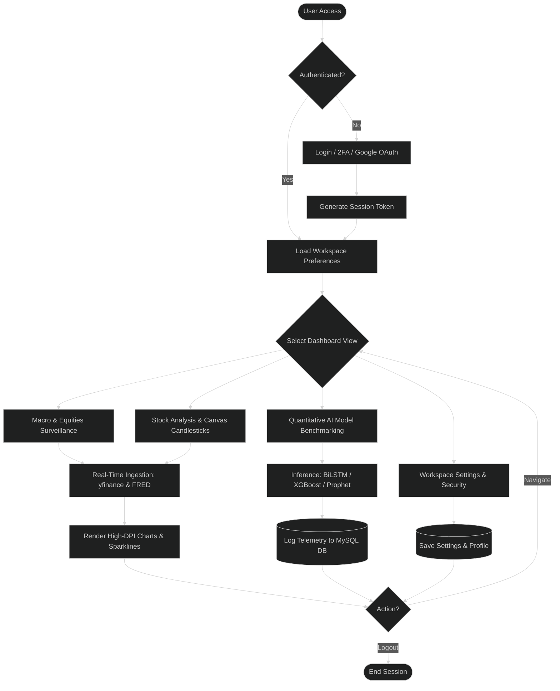

# 🔄 MacroPulse Institutional Terminal — Clean System Flowchart

A structured, clean, textbook-grade **System Flowchart** for the **MacroPulse Institutional Terminal**, organized into 4 distinct modular architectural layers to eliminate line crossing and clutter.

---

## 📌 1. Clean Structured Flowchart (Mermaid.js)

---

## 📌 2. Simplified High-Level Executive Flowchart (For FYP Overview Slides)

If you need a very high-level, compact version for presentation slides or thesis executive summaries:

