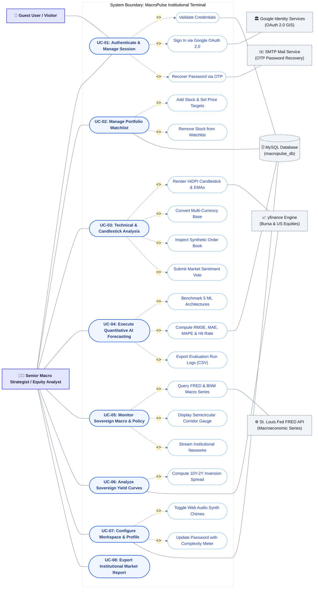

# 👥 MacroPulse Institutional Terminal — UML Use Case Diagram & Specification

This document presents the complete **UML Use Case Model** for the **MacroPulse Institutional Terminal**, illustrating interactions between human actors, the system boundary, primary use cases, `<<include>>` / `<<extend>>` relationships, and external supporting systems (APIs and databases).

---

## 📌 1. UML Use Case Diagram (Mermaid.js)

---

## 📋 2. Comprehensive Use Case Specification Table (For FYP Chapter 3)

| UC ID | Use Case Name | Primary Actor | Supporting Systems | Description | Relationship |
| :--- | :--- | :--- | :--- | :--- | :--- |
| **UC-01** | **Authenticate & Manage Session** | Guest / Analyst | MySQL, Google OAuth, SMTP | Enables user registration, email/password login, Google OAuth 2.0 sign-in, and 6-digit OTP password recovery. | `<<include>>` Validate Credentials `<<extend>>` Google OAuth `<<extend>>` OTP Reset |
| **UC-02** | **Manage Portfolio Watchlist** | Analyst | MySQL Database | Allows analysts to bookmark Bursa Malaysia (`.KL`) and US tickers, set target entry/exit prices, and write investment notes. | `<<extend>>` Add Stock `<<extend>>` Remove Stock |
| **UC-03** | **Technical & Candlestick Analysis** | Analyst | `yfinance` Data Service | Renders HiDPI HTML5 Canvas candlesticks, volume bars, dual EMAs (20/50), currency conversions (MYR/USD/EUR/SGD), order book ladder, and sentiment voting. | `<<include>>` Render Canvas `<<extend>>` FX Conversion `<<extend>>` Order Book `<<extend>>` Sentiment Vote |
| **UC-04** | **Execute Quantitative AI Forecasting** | Analyst | MySQL Database | Benchmarks 5 machine learning models (BiLSTM, XGBoost, Prophet, SARIMAX, PatchTST), projects multi-horizon price targets with 95% confidence intervals, and exports CSV logs. | `<<include>>` Benchmark ML `<<include>>` Compute Metrics `<<extend>>` Export CSV Logs |
| **UC-05** | **Monitor Sovereign Macro & Policy** | Analyst | St. Louis Fed (FRED) API | Ingests BNM OPR, headline inflation, GDP growth, and Federal Reserve series with in-memory TTL caching, policy corridor gauge, and real-time streaming newswire. | `<<include>>` Query FRED `<<include>>` Corridor Gauge `<<include>>` Stream Newswire |
| **UC-06** | **Analyze Sovereign Yield Curves** | Analyst | `yfinance` Data Service | Renders multi-country sovereign bond term structures (MGS, UST, Bund, JGB) from $1\text{M}$ to $30\text{Y}$ and detects $10\text{Y}-2\text{Y}$ yield curve inversion. | `<<include>>` 10Y-2Y Inversion Spread |
| **UC-07** | **Configure Workspace & Profile** | Analyst | MySQL Database | Enables updates to analyst bio, avatar upload, password complexity validation, audio chime toggles, and notification alert thresholds. | `<<extend>>` Web Audio Synth `<<extend>>` Password Meter |
| **UC-08** | **Export Institutional Market Report** | Analyst | Browser Print / PDF | Generates a formatted, printable PDF executive summary of real-time macroeconomic indicators, technical charts, and AI model performance metrics. | Standalone |

---

## 🎭 3. Actor Definitions

| Actor | Category | Description |
| :--- | :--- | :--- |
| **Guest User / Visitor** | Human (Primary) | Unauthenticated user visiting the portal who can sign up, log in, or initiate OTP password resets. |
| **Senior Macro Strategist / Equity Analyst** | Human (Primary) | Fully authenticated institutional user with access to all 6 trading and macroeconomic dashboards, quantitative models, and personal workspace settings. |
| **Google Identity Services (OAuth 2.0 GIS)** | External System (Secondary) | Cloud OAuth 2.0 authentication service used for one-click corporate single sign-on. |
| **SMTP Mail Service** | External System (Secondary) | Automated transactional email service delivering 15-minute expiration OTP codes for password recovery. |
| **yfinance Data Engine** | External System (Secondary) | High-speed financial quotes provider delivering live tick and historical OHLCV data for Bursa Malaysia (`.KL`) and US equity markets. |
| **St. Louis Fed (FRED) API** | External System (Secondary) | Official REST endpoint for sovereign macroeconomic time series (FEDFUNDS, CPI, GDP, Treasury Yields). |
| **MySQL Database (`macropulse_db`)** | Persistence System (Secondary) | Relational database persisting users, sessions, watchlists, workspace preferences, and model telemetry logs. |
